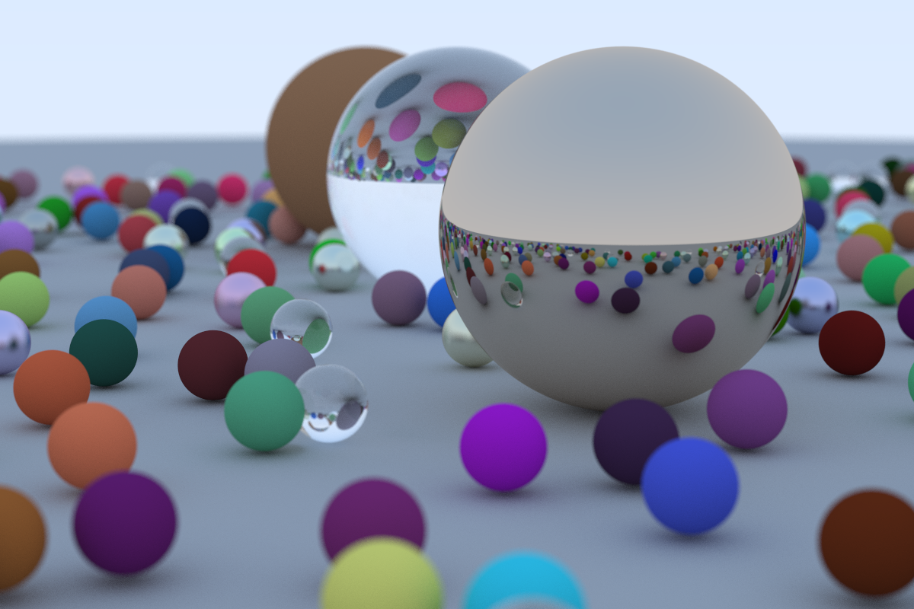

# RayTracing

a repo implementing the Ray Tracing in One Weekend Book Series  
image data is outputed in the ppm format to the std::cout buffer, it can be redirected to a file with batch commands  
run [This script](./x64/Release/SaveImage.bat) to save the output as a ppm image

## Preview

Image was converted from ppm to png  
Took about 2 hours to run single-threaded on a 4th gen i5 cpu  

## Resources

[Ray Tracing in one Weekend](https://raytracing.github.io/)	
